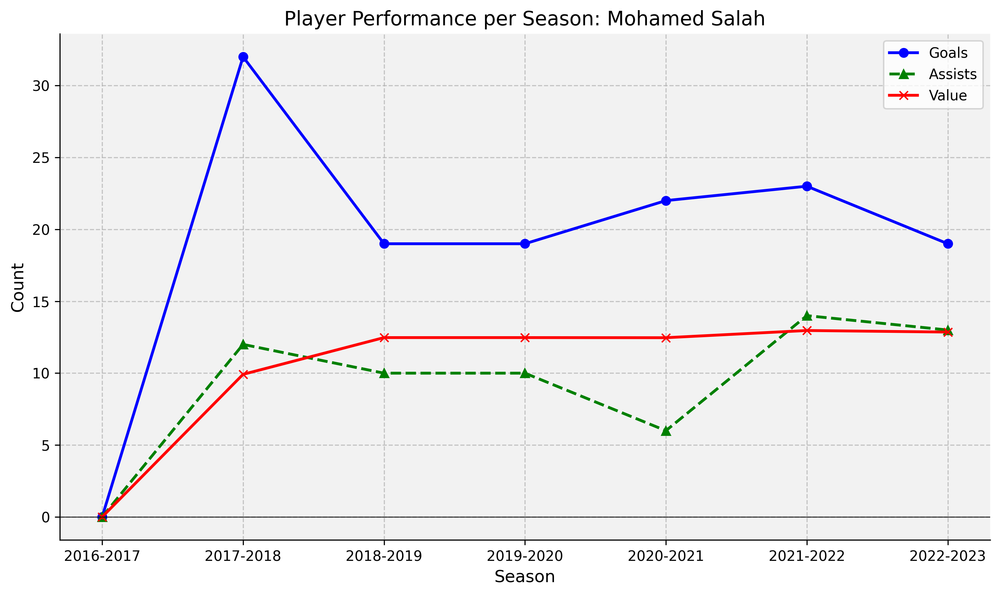
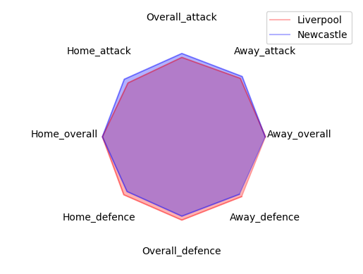

Scrape fpl database for generic team and individual statistics (clean_data.py) and save useful stats to .csv for offline viewing 

==clean_data.py ==

|Name|Description|Arguments|Return|
|---|---|---|---|
|scrape_data() | Takes data from FPL api, saves a local copy. (players_raw.csv, player_idlist.csv, cleaned_players.csv) | None | None |
|get_gw_data()|Requests data for a single player and returns player performance for each gameweek|player_id (can be found in player_idlist.csv)|Stats for each gameweek|
|get_extended_gw_data()|Requests for additional stats (xg, xa, etc) for each gw|player_id ()found in player_idlist.csv|DataFrame with additional stats for each gameweek|
|get_all_gw_data()|Gets all GW stats for all players|None| Saves a merged_gw.csv to local directory|
|format_historical_csv()|Formats player names in old FPL merged_gw.csv files from vaasav#s github repo, changes the player names column so the names are cosistent for data analysis. This function is very rarely used|None|None|

==player_analysis==

|Name|Description|Arguments|Return|
|---|---|---|---|
|economy()|Calculates the number of points a player has scored per £1million|player_id (can be obtained from player_idlist.csv or by using get_player_roster(team_id))|returns player economy stat|
|percentage_matches_starts()|Returns the percentage of matches a player has started a game this season|player_id (can be obtained from player_idlist.csv or by using get_player_roster(team_id))|pms (percentage matches started)|
|player_efficiency()|Calculates a ratio of how well a player is performing in relation to their expected goals/assists, a return value < 1 means player is under performing conversely a value of > 1 means a player is overperforming.|player_id (can be obtained from player_idlist.csv or by using get_player_roster(team_id))|goals_efficiency, assists_efficiency|
|player_contribution()|Calculates the percentage of goals a player has been directly involved with (goals & assists) for their club|player_id (can be obtained from player_idlist.csv or by using get_player_roster(team_id))|percent_goal_involvement|

==individual_player_statistics.py==

The figure below is a combination of the FPL_history function from individual_player_statistics.py . A players name (First + Second name) is passed through the function. Data is collated through all of the merged_gw.csv files in the repo, producing the figure below that shows the number of goals/assists/value of a player for all seasons. (Note: Player names with accents are returning an error. A fix will be introduced at some point).

==team_analysis.py==

|Name|Description|Arguments|Return|
|---|---|---|---|
|update_bootstrap_data()|Requests current season for teams (It seems that FPL API is not updating this data and hasn't done for sometime)|None|DataFrame containing team data|
|clean_team_data()|Used in conjunction with update_bootstrap_data() this function adds a attacking_overall and defence_overall stat to each of the teams and reinserts them into the dataframe|season (eg., "2023-2024")|None (saves a new csv file containing each teams strength)|
|copy_premier_league_table()|Scrapes the premier league table of SkySports website and converts it into a usable dataframe|None|DataFrame containing the current Premier League Table|
|get_player_roster()|Returns all players for the requested club.|Team ID number (Found in the talbe below)|DataFrame containing players in a single club|
|h2h_results()|Takes two teams and retrieves recent matches in Premier League dating back to 2020 (Limited by fpl data downloaded), returns the score and who won |team(string) - Team you want to analyse, opp_teams(string) - opponent team you want to compare results with|Returns DataFrame with containing kickoff_time, was_home, team, team_score, opp_score, opp_team_name, result|

==FPL Team_ID==
|ID|Team|
|---|---|
|1|Arsenal|
|2|Aston Villa|
|3|Bournemouth|
|4|Brentford|
|5|Brighton|
|6|Burnley|
|7|Chelsea|
|8|Crystal Palace|
|9|Everton|
|10|Fulham|
|11|Liverpool|
|12|Luton Town|
|13|Manchester City|
|14|Manchester United|
|15|Newcastle United|
|16|Nottingham Forest|
|17|Sheffield United|
|18|Tottenham Hotspur|
|19|West Ham United|
|20|Wolverhampton Wanderers|

==fixtures.py==

contains a single function, that returns the full premier league fixture list for the current season, with names of teams, kickoff time, difficuty, score and match details.

==data_visualisation_tools.py==

File containing all the functions for different types of data visualisation plots.
|Name|Description|Arguments|Return|
|---|---|---|---|
|get_team_strength_stats()|Takes stored strength stats from the .csv file for two teams and creates a octagon plot overlaying the differences in strength areas|team_name(string), opponent_name(string)|Returns an octagon plot (shown below)|

