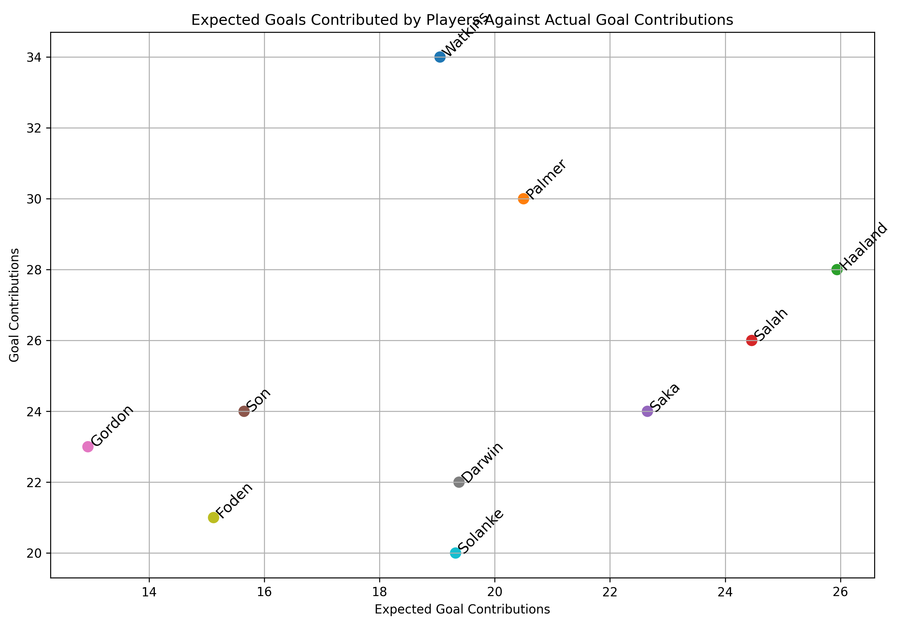

# Football Data Analysis Project (FPL/FBREF)

## Contents

1) [Introduction](https://github.com/chowvb/FPL_analysis#introduction)
2) [FPL Analysis](https://github.com/chowvb/FPL_analysis#fpl-analysis)
3) [FBref Analysis](https://github.com/chowvb/FPL_analysis#fbref-analysis)
4) [Liverpool FC Analysis](https://github.com/chowvb/FPL_analysis#liverpool-fc-analysis)

## Introduction
A repository that has a library for Fantasy Premier League (FPL) and FBref data for teams and players. 
This projects serves as a platform for me to learn data analysis and webscraping techniques as well as apply them to a real world application. 

### Data Structure
There are two data folders within this repository:
- data/ : Contains FPL data split into seasons. 
  - data/2023-2024/cleaned_players.csv : contains a cleaned overview stats for each player for a season
  - data/2023-2024/merged_gw.csv : contains every gw data for each player in FPL
- fbref_data/ : Contains player and team data split into seperate folders.
  - fbref_data/team_data : Contains different .csv files for different stats that can be used (creativity, defense, goalkeeping, passing, shooting, etc,)
  - fbref_data/player_data : Contains the same data as team_data but for individual players rather than teams (NOTE - The function that scrapes the data off fbref is still not operational due to fbrefs anti-bot check, which causes the script to fail.)

## FPL Analysis 
Using FBref as a source of football data should be able to enhance decision making when changing players during the FPL season, as FBref contains more indepth performance statistics that the FPL endpoint doesn't provide.
###### Top Performers

###### History
By visualising a players historical performance in the Premier League can give a slight insight into how they might perform in the current season - For example look at Mohamed Salah (Below). Since he joined the premier league hes consistantly scored ~ 20 goals per season.

## Fbref Analysis

## Liverpool FC Analysis

