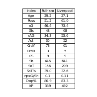

# Football Data Analysis Project (FPL/FBREF)

## Contents

1) [Introduction](https://github.com/chowvb/FPL_analysis#introduction)
2) [FPL Analysis](https://github.com/chowvb/FPL_analysis#fpl-analysis)
3) [FBref Analysis](https://github.com/chowvb/FPL_analysis#fbref-analysis)
4) [Liverpool FC Analysis](https://github.com/chowvb/FPL_analysis#liverpool-fc-analysis)

## Introduction
A repository that has a library for Fantasy Premier League (FPL) and FBref data for teams and players. 
This projects serves as a platform for me to learn data analysis and webscraping techniques as well as apply them to a real world application. 

### Data Structure
There are two data folders within this repository:
- data/ : Contains FPL data split into seasons. 
  - data/2023-2024/cleaned_players.csv : contains a cleaned overview stats for each player for a season
  - data/2023-2024/merged_gw.csv : contains every gw data for each player in FPL
- fbref_data/ : Contains player and team data split into seperate folders.
  - fbref_data/team_data : Contains different .csv files for different stats that can be used (creativity, defense, goalkeeping, passing, shooting, etc,)
  - fbref_data/player_data : Contains the same data as team_data but for individual players rather than teams (NOTE - The function that scrapes the data off fbref is still not operational due to fbrefs anti-bot check, which causes the script to fail.)

## FPL Analysis 
Using FBref as a source of football data should be able to enhance decision making when changing players during the FPL season, as FBref contains more indepth performance statistics that the FPL endpoint doesn't provide.
##### Top Performers

(Figure based off player performance upto GW7)
From the graphic above you can see the high performing players depeding on their goal contributions against their expected goal contribitions. Suprisingly Ollie Watkins has the most goal contributions (Goals + Assists) up to gameweek 7. Erling Haaland understandably has a high number of expected goal contributions but he also has converted alot of those chances. J.Alvarez might be a player to watch throughout the season as similar to Ollie Watkins he has a high goal contribution output in comparison to his actual goal contributions. 
From this figure we are looking to find players who overperform against their expected goal contributions. 
##### History
By visualising a players historical performance in the Premier League can give a slight insight into how they might perform in the current season - For example look at Mohamed Salah (Below). Since he joined the premier league hes consistantly scored ~ 20 goals per season.

## Fbref Analysis

## Liverpool FC Analysis
All analysis is found within liverpool_analysis.py. This script aims to identify Liverpool Fc's next opponent in the Premier League, the date/time the game kicks off as well as FPL's difficulty rating for the upcoming game between 1-5 (1 = Easier, 5 = Tough). 
Recent head to head matchups in the Premier League are then queried from FPL's historical games. Showing the result, score and whether Liverpool were playing at Anfield or away from home (See Figure below).   

A table of players to watch during the game is then generated, by filtering FPL's players database for players either playing for Liverpool or for the away team. With the table displaying the top 5 inform players (Based of FPL points). The table displays the Players to watch, the total fpl points the player has accumulated as well as the goals/assists and form (Average points scored in recent FPL games). (See Figure below)  

From the football database FBref. The team stats for both the teams are collated with the most useful/interesting stats being inserted into the table below  

The head to head matchup can be seen in the figure below. Liverpool can be compared to the oppoenent team as well as the league average.
