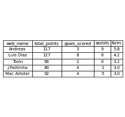
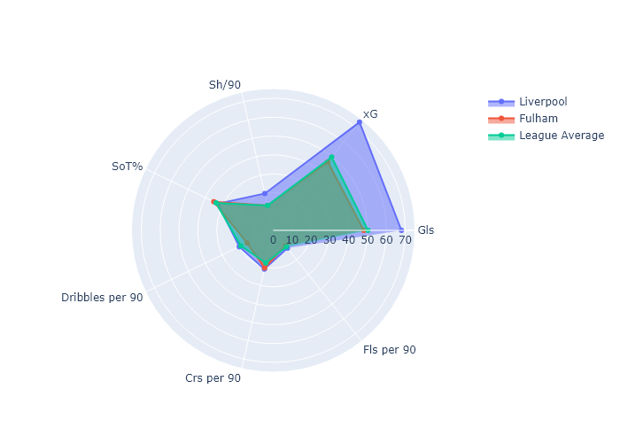

# Football Data Analysis Project (FPL/FBREF)

## Contents

1) [Introduction](https://github.com/chowvb/FPL_analysis#introduction)
2) [FPL Analysis](https://github.com/chowvb/FPL_analysis#fpl-analysis)
3) [FBref Analysis](https://github.com/chowvb/FPL_analysis#fbref-analysis)
4) [Liverpool FC Analysis](https://github.com/chowvb/FPL_analysis#liverpool-fc-analysis)
5) [Post-Season Analysis](https://github.com/chowvb/FPL_analysis#post-season-analysis)
   1) [Set Pieces](https://github.com/chowvb/FPL_analysis#set-pieces)

## Introduction
A repository that has a library for Fantasy Premier League (FPL) and FBref data for teams and players. 

Fantasy Premier League is a popular game among football suppoerters where people start with a budget of £100m and build a football team comprising of players who play in the Premier League. When a football match is played, players playing in each of the matches will score points depending on their performance. The aim of the game is to score the most points within the season (38 Matchweeks). 

Each game week the premier league release the statistics for each of the players (Points scored, goals scored, assissts made, shots taken, yellow/red cards etc) these pieces of information can be analysed to see how a player is performing in relation to their price tag, which players are inform (Playing well).

FBref is a football statistics website that releases more data than the premier league releases every week. FBref includes football played in all compititions across Europe.

This projects serves as a platform for me to learn data analysis and webscraping techniques as well as apply them to a real world application.
 

### Data Structure
There are two data folders within this repository:
- data/ : Contains FPL data split into seasons. 
  - data/2023-2024/cleaned_players.csv : contains a cleaned overview stats for each player for a season
  - data/2023-2024/merged_gw.csv : contains every gw data for each player in FPL

- fbref_data/ : Contains player and team data split into seperate folders.
  - fbref_data/team_data : Contains different .csv files for different stats that can be used (creativity, defense, goalkeeping, passing, shooting, etc,)
  - fbref_data/player_data : Contains the same data as team_data but for individual players rather than teams (NOTE - The function that scrapes the data off fbref is still not operational due to fbrefs anti-bot check, which causes the script to fail.)

## FPL Analysis 
Using FBref as a source of football data should be able to enhance decision making when changing players during the FPL season, as FBref contains more indepth performance statistics that the FPL endpoint doesn't provide.
##### Top Performers

(Figure 1. based off player performance upto GW34)  
When which players to include in a Fantasy Premier League team, the majority of your points will likely come from attacking players (Those that score/assist goals). Having a goal contibution equal to or greater than expected goal contributions (xG + xA) means that a player is exceeding expectations in terms of his impact on team performance, as FPL rewards goal contributions choosing players who perform greater than their expectations is safe way to score points. Olli Watkins for example in Figure 1 has contributed 34 goals so far this season (Goals and assists combined), which averages to one per game this is far greater than his expected goal contributions which is scored at 19. He has far been the most important player in Aston Villa's campaign to qualify for the Champions League next season. He is by far the stand out player in this figure although, Anthony Gordon is another player who's ouput numbers are equally impressive when looking at a Expected vs Goal contributions, as hes expected to have contributed 13 goals towards Newcastle's campaign but in actuallity has contributed 23 goals to their season. as a ratio this is actually better than Olli Watkins.  
Figure 1 only shows the top ten players, within the data it would be easy to return the top 20 players to potentially find a wildcard player that not many other people (Other FPL players) have. Mo Salah and Erling Haaland are very common players to include in FPL teams purely because they consistently produce goals, as seen in figure 1 they are within the top 4 players in the league

From the graphic above you can see the high performing players depeding on their goal contributions against their expected goal contribitions. Suprisingly Ollie Watkins has the most goal contributions (Goals + Assists) up to gameweek 7. Erling Haaland understandably has a high number of expected goal contributions but he also has converted alot of those chances. J.Alvarez might be a player to watch throughout the season as similar to Ollie Watkins he has a high goal contribution output in comparison to his actual goal contributions. 
From this figure we are looking to find players who overperform against their expected goal contributions. 

## Fbref Analysis

## Liverpool FC Analysis
All analysis is found within liverpool_analysis.py. This script aims to identify Liverpool Fc's next opponent in the Premier League, the date/time the game kicks off as well as FPL's difficulty rating for the upcoming game between 1-5 (1 = Easier, 5 = Tough). 
Recent head to head matchups in the Premier League are then queried from FPL's historical games. Showing the result, score and whether Liverpool were playing at Anfield or away from home (See Figure below).   

A table of players to watch during the game is then generated, by filtering FPL's players database for players either playing for Liverpool or for the away team. With the table displaying the top 5 inform players (Based of FPL points). The table displays the Players to watch, the total fpl points the player has accumulated as well as the goals/assists and form (Average points scored in recent FPL games). (See Figure below)  

From the football database FBref. The team stats for both the teams are collated with the most useful/interesting stats being inserted into the table below  

The head to head matchup can be seen in the figure below. Liverpool can be compared to the oppoenent team as well as the league average.
An interactive version of this image can be found in [Interactive Plots](interactive_plots/)

## Post Season Analysis
Following the conclusion of 

### Set Pieces analysis
| Squad           |   PassDead_x |   PassDead_y |   Efficiency (%) |
|:----------------|-------------:|-------------:|-----------------:|
| Arsenal         |           82 |           16 |               20 |
| Aston Villa     |           77 |            8 |               10 |
| Bournemouth     |           70 |            3 |                4 |
| Brentford       |          102 |            7 |                7 |
| Brighton        |           87 |            5 |                6 |
| Burnley         |           74 |            6 |                8 |
| Chelsea         |           62 |            7 |               11 |
| Crystal Palace  |           74 |            4 |                5 |
| Everton         |           82 |            5 |                6 |
| Fulham          |           79 |            6 |                8 |
| Liverpool       |          116 |            8 |                7 |
| Luton           |           73 |            7 |               10 |
| Man City        |           65 |            5 |                8 |
| Man Utd         |           79 |            4 |                5 |
| Newcastle       |           69 |            7 |               10 |
| Nott'ham Forest |           67 |            5 |                7 |
| Sheffield Utd   |           59 |            2 |                3 |
| Spurs           |           60 |            7 |               12 |
| West Ham        |           91 |           11 |               12 |
| Wolves          |           67 |            7 |               10 |